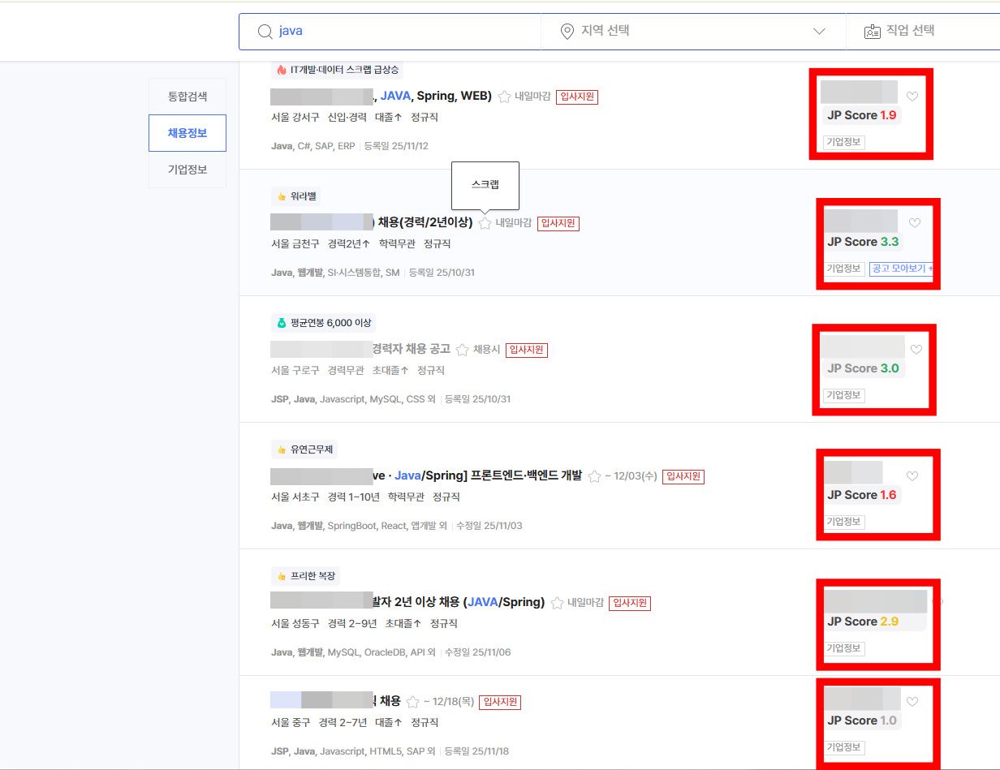
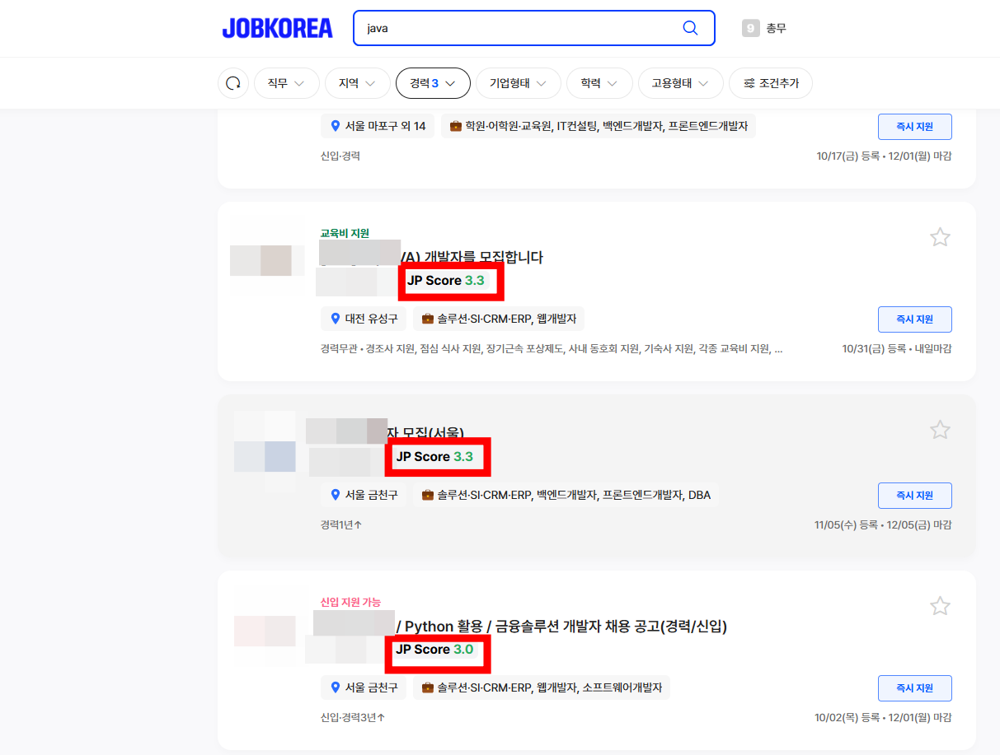

# jp-company-score
사람인(Saramin)·잡코리아(JobKorea) 공고에서 잡플래닛(JobPlanet) 기업 점수를 바로 보여주는 크롬 확장입니다.

## 주요 기능
- 사람인/잡코리아 공고에 잡플래닛 평점을 자동 표시, 클릭 시 해당 잡플래닛 페이지로 이동
- 기업명 정규화: ㈜, (주), 주식회사, 유한회사 등 표기 차이를 제거해 정확히 매칭
- 요청 최적화: 같은 회사명 요청은 캐시해서 재사용, 진행 중인 요청도 공유해 중복 트래픽 최소화
- 견고한 파서: 잡플래닛 DOM 변경 시를 대비해 느슨한 선택자와 숫자 추출로 점수 파싱
- 콘솔 로그: 매칭/점수 실패 시 상태 코드·HTML 샘플을 경고로 남겨 디버깅 용이

## 사용 방법
1) 크롬 확장 프로그램 `개발자 모드`에서 `압축 해제된 확장 프로그램 로드`로 이 폴더를 선택  
2) 사람인 또는 잡코리아에서 검색/목록 페이지를 열면 기업명 옆에 `JP Score`가 붙습니다. 클릭하면 잡플래닛 검색 결과로 이동합니다.

## 주의/제한
- 잡플래닛에 기업이 없거나 이름이 다르면 `N/A`로 표시됩니다.
- 잡플래닛에 로그인되어야 검색 페이지가 정상 응답할 수 있습니다(403 등 차단 시 콘솔 로그 확인).

## 스크린샷
### 사람인

### 잡코리아

## 개인정보 보호
- 개인정보 수집/서버 전송/추적 코드 없음
- 계정·쿠키는 잡플래닛 검색용으로만 사용되며 외부로 전송하지 않음

## 아이콘
- gpt sora 사용 제작
